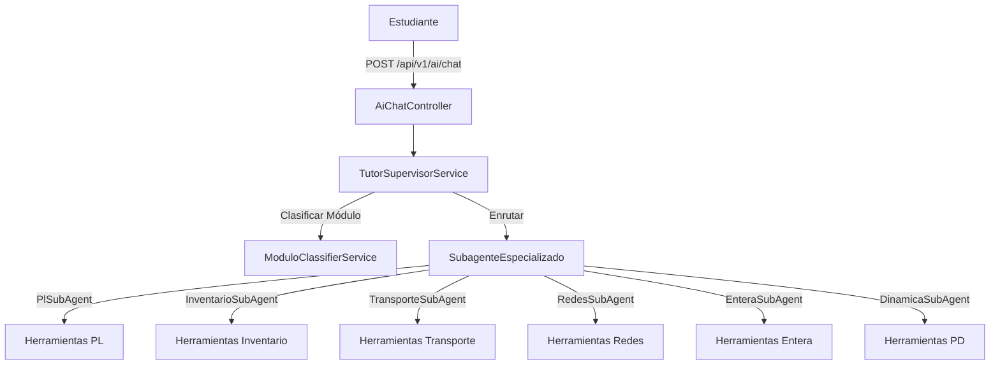

# Informe Técnico — Plataforma de Investigación Operativa con Tutoría IA

> Generado a partir del estado real del código con Arquitectura Multi-Agente, Clasificador LLM
> y Validación Pedagógica Human-in-the-Loop (HITL) con Sincronización UI (2026-07).
> Cubre arquitectura hexagonal, los 6 módulos de IO, capa de IA orquestada, patrones de diseño y flujo de datos.

---

## 1. Qué es el proyecto

Plataforma web **genérica** de Investigación Operativa (IO): el usuario introduce los
datos de su propio problema (no hay casos de estudio precargados) y el sistema lo
resuelve mostrando el **procedimiento paso a paso**, acompañado de un **tutor
socrático asistido por IA** ("Asistente Pivot") que guía el razonamiento sin entregar
la respuesta antes de que el estudiante entienda el modelo.

El proyecto se compone de dos aplicaciones independientes en el mismo repositorio:

| Carpeta | Rol | Stack |
|---|---|---|
| `io-api/` | Backend: solvers matemáticos + orquestación de IA | Spring Boot 4.1.0, Java 21 |
| `io-ui/` | Frontend: shell de navegación + workspace de módulos | React 19 + Vite, TypeScript |

### Los seis módulos de IO implementados

| Módulo | Estado |
|---|---|
| **Programación Lineal (LP)** | ✅ Simplex, Gran M, Dos Fases y Método Gráfico implementados con análisis de sensibilidad y subagente `PlSubAgent`. |
| **Transporte** | ✅ Esquina Noroeste, Costo Mínimo, Vogel (VAM) y MODI implementados con subagente `TransporteSubAgent`. |
| **Redes** | ✅ Dijkstra, Kruskal, Edmonds-Karp, Flujo de Costo Mínimo y Asignación implementados con subagente `RedesSubAgent`. |
| **PL Entera** | ✅ Branch & Bound implementado con variables enteras/binarias y subagente `EnteraSubAgent`. |
| **Programación Dinámica** | ✅ Mochila, Asignación de recursos, Ruta por etapas, Producción y Reemplazo implementados con subagente `DinamicaSubAgent`. |
| **Inventarios** | ✅ EOQ Básico, Descuentos, Faltantes, POQ y Punto de Reorden implementados con subagente `InventarioSubAgent`. |

---

## 2. Arquitectura

### 2.1 Backend — hexagonal por capas

```
infrastructure  (Spring MVC, JPA, LangChain4j, REST, CORS)
    └── application  (casos de uso / puertos: {Algoritmo}UseCase + {Algoritmo}Service)
            └── domain  (Java puro: records + algoritmos, cero anotaciones de framework)
```

**Reglas de capa (inviolables, verificadas en el código actual):**

- `domain/` — cero `@Service`/`@Component`/`@Entity`, cero imports de
  `org.springframework.*`, `dev.langchain4j.*` o `jakarta.persistence.*`. Solo
  records inmutables y lógica matemática. Cada solver es una clase con un único
  método público `resolver(Modelo) → SolveResult<Solucion>` que **nunca lanza
  excepción por infactible o no acotado** — son resultados válidos del dominio.
  Las excepciones (`IllegalArgumentException`) se reservan para entradas
  malformadas (dimensiones inconsistentes, RHS negativo cuando el método lo exige).
- `application/` — interfaces de puerto (`SimplexUseCase`, `GranMUseCase`,
  `DosFasesUseCase`, `GraficoUseCase`) + su `@Service` que delega al solver del
  dominio sin lógica propia.
- `infrastructure/` — todo lo "impuro": `@RestController`, JPA, `@Tool` de
  LangChain4j, `AiConfig`, CORS, RAG.

Dirección de dependencias, sin excepciones: `infrastructure → application → domain`.
El dominio no conoce a nadie por encima de él.

### 2.2 Paquete raíz real (`jpap.dev.io_api`)

```
domain/
├── common/            SolveResult<T>, SolveStep, SolveStatus
└── lp/
    ├── ModeloLP, FuncionObjetivo, Restriccion       (entrada, records inmutables)
    ├── TipoObjetivo (MAXIMIZAR/MINIMIZAR), TipoRestriccion (LEQ/GEQ/EQ)
    ├── SolucionLP, RangosSensibilidad, RangoCoeficiente, RangoRHS   (salida)
    ├── SensibilidadCalculator                        (utilidad estática compartida)
    ├── simplex/SimplexSolver                          Simplex estándar (solo ≤)
    ├── granm/GranMSolver                              Gran M (≤/≥/=)
    ├── dosfases/DosFasesSolver                        Dos Fases (≤/≥/=)
    └── grafico/GraficoSolver, SolucionGrafica,
               PuntoVertice, LineaGraficoData          Método gráfico (2 variables)

application/lp/
    {Simplex,GranM,DosFases,Grafico}UseCase + Service   (delegan 1:1 al solver)

infrastructure/
├── lp/          {Simplex,GranM,DosFases,Grafico}Controller  → POST /api/v1/lp/{...}
├── ai/
│   ├── TutorAiService (interfaz conversacional, @MemoryId + @UserMessage)
│   ├── ModeloAiService (interfaz structured-output, sin memoria)
│   ├── AiConfig (beans manuales AiServices.builder())
│   ├── AiChatController (3 endpoints: /chat, /sugerir-modelo, /validar-modelo)
│   ├── ChatContextStore (ThreadLocal, bus tools → controller)
│   ├── tools/   {Simplex,GranM,DosFases,Grafico,SugerirModelo,ValidarModelo}Tool
│   ├── dto/     Chat{Request,Response}, {Sugerir,Validar}Modelo{Request,Response}
│   └── rag/     RagConfig, CorpusIngester
└── web/         GlobalExceptionHandler, WebConfig (CORS localhost:*)
```

Nota: los documentos internos `docs/ESTRUCTURA_PAQUETES.md` y `docs/ARQUITECTURA_IA.md`
están un paso por detrás del código — no listan aún `GraficoSolver`/`GraficoTool`
ni el cuarto campo `resultadoGrafico` de `ChatContextStore`. Este informe refleja el
código real, que sí los incluye.

### 2.3 Frontend — capas unidireccionales

```
pages/components  →  hooks/  →  { store/ (Zustand) | api/ (fetch tipado) }  →  types/
```

Regla clave: los componentes **nunca** llaman a `api/` ni escriben en el store
directamente — todo pasa por un hook. Esto permite añadir un módulo de IO nuevo
replicando el patrón de hooks sin reescribir componentes.

Shell persistente (`AppShell.tsx`): rail vertical de íconos (`ModuleRail`, 44px) +
toolbar (`TopBar`, 36px) que envuelven un `<Outlet/>` por módulo. Actualmente solo
`/lp` está habilitado; los otros cinco módulos se muestran deshabilitados en el rail
para comunicar el roadmap completo. El workspace de LP (`SimplexWorkspace.tsx`)
combina chat + editor de modelo + tableau + gráfico en una sola vista — el método
Gráfico ya no es una página separada, es un resultado más que puede coexistir con
el tableau.

---

## 3. Stack tecnológico

| Capa | Tecnología | Versión |
|---|---|---|
| Backend | Spring Boot | 4.1.0 |
| Lenguaje backend | Java (toolchain) | 21 |
| Build | Gradle | flag `-parameters` obligatorio (Jackson deserializa records sin `@JsonCreator`) |
| IA — framework | LangChain4j | 1.13.0-beta23 |
| LLM | Groq (`llama-3.3-70b-versatile`) vía API OpenAI-compatible | — |
| Embeddings | AllMiniLM-L6-V2 Quantized (local, CPU, sin API key) | — |
| Vector store | ChromaDB, API **v2** | imagen `chromadb/chroma` |
| Parser PDF | Apache PDFBox (`langchain4j-document-parser-apache-pdfbox`) | 1.13.0-beta23 |
| BD relacional | PostgreSQL | 16 |
| Migraciones | Flyway | `baseline-on-migrate: true` |
| Frontend | React + Vite | React 19.2, Vite 8 |
| UI | shadcn/ui + Tailwind CSS 4 | — |
| Estado global | Zustand | 5 |
| Formularios | React Hook Form + Zod | — |
| HTTP/cache | TanStack Query | 5 |
| Fórmulas | KaTeX (`rehype-katex`, `remark-math`) | — |
| Router | React Router | 7 |
| Gráficos | Recharts (región factible del método gráfico) | 3 |

### Nota crítica de LangChain4j 1.13.0

En esta versión `ChatLanguageModel` fue renombrado a **`ChatModel`**
(`dev.langchain4j.model.chat.ChatModel`). El builder usa `.chatModel(...)`, no
`.chatLanguageModel(...)`. El proyecto **no usa `@AiService`** del starter — todos
los subagentes (`PlSubAgent`, `InventarioSubAgent`, `TransporteSubAgent`, `RedesSubAgent`,
`EnteraSubAgent`, `DinamicaSubAgent`), el clasificador (`ModuloClassifierService`)
y el orquestador (`TutorSupervisorService`) se construyen o integran en `AiConfig.java`.

El identificador del modelo (`GROQ_MODEL_NAME`) y la API key (`GROQ_API_KEY`) se
leen siempre de variables de entorno — nunca hardcodeados, nunca commiteados
(`application.yaml` solo referencia `${...}`).

---

## 4. Programación Lineal — algoritmos (énfasis especial)

Todos los solvers de LP comparten el mismo contrato de entrada/salida y la misma
convención de tableau, lo que permite reutilizar `SensibilidadCalculator` entre los
tres métodos algebraicos.

### 4.1 Contrato común

```java
public record SolveResult<T>(SolveStatus status, T solution, List<SolveStep> steps) {}
public record SolveStep(int numero, String titulo, String descripcion, Map<String, Object> datos) {}
// SolveStatus: OPTIMO | INFACTIBLE | NO_ACOTADO | MULTIPLE_OPTIMO | ERROR
```

```java
public record ModeloLP(List<String> variables, FuncionObjetivo objetivo, List<Restriccion> restricciones) {}
public record FuncionObjetivo(List<Double> coeficientes, TipoObjetivo tipo) {}   // MAXIMIZAR | MINIMIZAR
public record Restriccion(List<Double> coeficientes, TipoRestriccion tipo, double rhs) {}  // LEQ | GEQ | EQ

public record SolucionLP(
    Map<String,Double> valores, Map<String,Double> holguras, double valorOptimo,
    Map<String,Double> preciosSombra, RangosSensibilidad rangosSensibilidad) {}
```

Cada `SolveStep` lleva en `datos` el tableau completo (`encabezados`, `tableau`
2D, `base`), y en los pasos de iteración además `varEntra`/`varSale` — esto es lo
que el frontend usa para el `TableauViewer` navegable y lo que el tutor usa para
explicar por qué entró/salió cada variable.

### 4.2 Convención de la fila-z (compartida por los tres solvers algebraicos)

- **MAX** `z = cᵀx` → se almacena **−c** en la fila z (óptimo cuando todos los
  coeficientes son ≥ 0).
- **MIN** `z = cᵀx` → se convierte internamente a **MAX w = −z**, almacenando
  **+c**; al final se revierte `zOpt = -w*`.
- Variables artificiales: siempre **+M** en la fila z, independientemente del
  sentido de optimización (tanto en Gran M como en la fila-z de Fase 1 de Dos
  Fases, que usa la misma convención con M=1 implícito al minimizar `w = Σaᵢ`).

Esta convención unificada es la razón por la que los tres solvers pueden compartir
`findEnterCol`/`findLeaveRow`/`pivot` con la misma implementación (duplicada
deliberadamente en cada clase — ver §7.3).

### 4.3 Simplex estándar (`SimplexSolver`)

**Alcance:** solo restricciones `LEQ` con `rhs ≥ 0` — hay una base factible trivial
en el origen (las holguras), por lo que no se necesitan variables artificiales.

**Algoritmo:**
1. Construye el tableau `m+1 × (n+m+1)`: cada restricción `i` obtiene una columna
   identidad de holgura `sᵢ` en la posición `n+i`.
2. Fila z: `isMin ? +c : -c` para las variables de decisión.
3. Itera (máx. 1000 iteraciones):
   - **Columna entrante** — regla de Dantzig: el coeficiente más negativo de la
     fila z (`t[m][j] < -ε`). Si no hay ninguno → óptimo alcanzado.
   - **Fila saliente** — prueba de razón mínima: `min(bᵢ / t[i][enterCol])` sobre
     filas con `t[i][enterCol] > ε`. Si ninguna fila califica → `NO_ACOTADO`.
   - **Pivote** Gauss-Jordan: divide la fila pivote por el elemento pivote, luego
     elimina la columna pivote del resto de filas (incluida la fila z).
4. Al terminar, si alguna variable no básica tiene costo reducido exactamente
   cero en la fila z → `MULTIPLE_OPTIMO`; si no, `OPTIMO`.

**Detección de casos especiales**, ambos como resultados válidos del dominio (no
excepciones):
- `NO_ACOTADO`: columna entrante sin ninguna fila con coeficiente positivo.
- `MULTIPLE_OPTIMO`: variable no básica con costo reducido = 0 en el óptimo.

### 4.4 Gran M (`GranMSolver`)

**Alcance:** `LEQ`/`GEQ`/`EQ` mixtas, `rhs ≥ 0` obligatorio. Introduce variables
artificiales penalizadas con `M = 1.000.000` en el objetivo para forzarlas fuera
de la base.

**Esquema de columnas** (una sola pasada, sin variables extra si no se necesitan):
```
nSlack = |{i : tipo ∈ {LEQ, GEQ}}|        nArt = |{i : tipo ∈ {GEQ, EQ}}|
Columnas: [ x1..xn | s1..s_nSlack | a1..a_nArt | RHS ]

LEQ → coeficiente de holgura +1, sin artificial, base inicial = holgura
GEQ → coeficiente de superávit −1, + artificial (+1), base inicial = artificial
EQ  → sin holgura, + artificial (+1), base inicial = artificial
```

**Algoritmo:**
1. Construye el tableau con la fila z de decisión (`isMin ? +c : -c`) y `+M` en
   cada columna artificial.
2. **Eliminación inicial**: como las artificiales entran básicas con coeficiente
   M en la fila z, se resta `M × filaArtificial` de la fila z para dejarla
   consistente con la base inicial antes de iterar (si no, el primer pivote
   sería incorrecto).
3. Corre Simplex estándar (mismas reglas de entrada/salida/pivote que §4.3).
4. **Verificación de factibilidad**: al terminar, si alguna variable artificial
   sigue básica con valor `> ε` → `INFACTIBLE` (la penalidad no bastó para
   sacarla, lo que significa que no hay solución factible sin ella).
5. `hasMultipleOptima` solo revisa las columnas `0..n+nSlack-1` — excluye
   artificiales deliberadamente, porque su costo reducido cero no indica un
   óptimo alternativo real, solo que la variable quedó forzada a cero.

### 4.5 Dos Fases (`DosFasesSolver`)

**Alcance:** igual que Gran M (`LEQ`/`GEQ`/`EQ`, `rhs ≥ 0`), pero evita la
inestabilidad numérica de una penalidad M arbitrariamente grande, resolviendo la
factibilidad y la optimalidad en dos Simplex secuenciales sobre el mismo tableau.

**Fase 1 — encontrar una solución básica factible:**
1. Mismo preprocesamiento de columnas que Gran M (holguras/superávit/artificiales).
2. Fila z auxiliar: `MIN w = Σ aᵢ` → coeficiente `+1` en cada columna artificial,
   0 en el resto. Se eliminan las artificiales básicas de esta fila (mismo ajuste
   que en Gran M, con factor 1 en vez de M).
3. Corre Simplex hasta optimalidad de `w`.
4. `w* = -t[m][cols-1]` (recordar la convención MIN → se almacena +w). Si
   `w* > ε` → `INFACTIBLE`: no existe punto que satisfaga todas las
   restricciones simultáneamente.

**Fase 2 — optimizar el objetivo real:**
5. Se restaura la fila z con los coeficientes originales del objetivo
   (`isMin ? +c : -c`); las columnas artificiales quedan en 0.
6. **Paso crítico** — reconciliación de la fila z con la base heredada de Fase 1:
   para cada fila básica `i`, si el coeficiente de su variable básica en la
   nueva fila z no es cero, se resta `factor × fila_i` de la fila z. Sin este
   paso la fila z queda inconsistente con la base actual y el criterio de
   optimalidad de Fase 2 sería inválido.
7. Corre Simplex con `findEnterColExcluding(artificiales)` — impide
   explícitamente que una variable artificial vuelva a entrar en Fase 2.

**Numeración de pasos continua**: los títulos incluyen `"Fase 1"` / `"Fase 2"`
explícitamente y el contador de pasos (`stepNum`) no se reinicia entre fases, de
modo que la UI y el tutor pueden narrar la transición sin lógica adicional.

### 4.6 Método Gráfico (`GraficoSolver`)

**Alcance:** exactamente 2 variables de decisión, cualquier combinación de
`LEQ`/`GEQ`/`EQ`. No usa tableau — es geometría computacional pura sobre el plano
`x1`-`x2`, y produce los datos que el frontend necesita para dibujar la región
factible con Recharts.

**Algoritmo:**
1. **Candidatos a vértice**: cada restricción se trata como una recta
   `a·x1 + b·x2 = rhs`; se agregan también las rectas `x1=0` y `x2=0` (no
   negatividad implícita). Se calculan las intersecciones de **todos los pares**
   de rectas (`Cramer` 2×2 vía determinante) — con `m` restricciones hay
   `(m+2 choose 2)` candidatos.
2. **Filtro de factibilidad**: cada candidato se evalúa contra todas las
   restricciones (`≤`/`≥`/`=` con tolerancia `ε`) y contra `x1,x2 ≥ 0`. Se
   deduplican los puntos coincidentes.
3. **Detección de infactibilidad**: si no queda ningún vértice factible →
   `INFACTIBLE`.
4. **Detección de no acotado**: se proyecta la dirección de mejora del
   objetivo (`+c` si MAX, `−c` si MIN, recortada al ortante no negativo) y se
   prueba un punto muy lejano (`1e6` de magnitud) en esa dirección — si ese
   punto extremo sigue siendo factible, la región se extiende indefinidamente
   en la dirección de mejora → `NO_ACOTADO`.
5. **Evaluación en vértices** (Teorema fundamental de la PL: el óptimo de un
   problema de PL acotado y factible siempre está en un vértice de la región
   factible): se evalúa `Z = c1·x1 + c2·x2` en cada vértice factible y se toma
   el mejor. Si más de un vértice empata en el óptimo → `MULTIPLE_OPTIMO`
   (indica un lado completo de la región, no solo un punto, es óptimo).
6. **Ordenar el polígono**: los vértices factibles se ordenan por ángulo
   respecto a su centroide (`atan2`) para que el frontend pueda dibujar el
   polígono convexo sin cruces.
7. **Pasos generados**: uno por restricción graficada progresivamente (para que
   el estudiante vea cómo cada restricción recorta la región), luego región
   factible identificada, evaluación en vértices, y solución óptima — cada paso
   lleva las líneas, los vértices y el polígono para que el frontend anime la
   construcción.

`GraficoSolver` es el único solver de LP que no reutiliza `SensibilidadCalculator`
— no hay tableau del que extraer precios sombra; `SolucionGrafica` es un record
distinto (`valores`, `valorOptimo`, `puntos` con bandera `esOptimo`, `region`,
límites del gráfico).

### 4.7 Análisis post-óptimo (`SensibilidadCalculator`)

Utilidad estática **compartida** por `SimplexSolver`, `GranMSolver` y
`DosFasesSolver` (no por `GraficoSolver`). Opera directamente sobre el tableau
final y la base óptima, sin recalcular nada desde cero:

- **Holguras**: `sᵢ = |valor de la columna de holgura de la restricción i en la
  solución básica|`. `sᵢ = 0` → restricción activa (recurso agotado); `sᵢ > 0` →
  capacidad sobrante.
- **Precios sombra**: `yᵢ = c_Bᵀ · B⁻¹ · eᵢ`, calculado como
  `Σₖ c_{base[k]} · t[k][columnaDeReferencia]`, usando los coeficientes
  **originales** del objetivo (sin la penalidad M). La columna de referencia es
  la de holgura para `LEQ` o la de la variable artificial para `GEQ`/`EQ` (el
  artificial arrancó la base con coeficiente `+1`, jugando el mismo rol que
  `B⁻¹eᵢ`).
- **Rangos de sensibilidad**:
  - *Coeficientes del objetivo*: si la variable es no básica, el rango se
    obtiene directamente del costo reducido en la fila z. Si es básica, se
    calcula el rango de `Δc` que preserva la optimalidad recorriendo las
    columnas no básicas y tomando el mínimo/máximo cociente `rcⱼ / t[r][j]`
    (con signo según MAX/MIN) — `null` representa `±∞` (sin límite).
  - *RHS*: rango de `Δb` que mantiene factible la base actual, recorriendo la
    columna `B⁻¹eᵢ` contra el vector de soluciones básicas actuales.

Este cálculo es la razón de que los tres endpoints de LP (`/simplex`, `/gran-m`,
`/dos-fases`) devuelvan siempre `preciosSombra` y `rangosSensibilidad` en
`SolucionLP` sin trabajo adicional por endpoint.

### 4.8 Selección de método — regla de negocio (vive en el prompt del tutor, no en código)

```
Todas las restricciones ≤ y b ≥ 0        → Simplex estándar
≥ o = presentes, sin pedido explícito     → Dos Fases (predeterminado)
≥ o = presentes + estudiante pide Gran M  → Gran M
Exactamente 2 variables + pide "gráfico"  → Método Gráfico
```

Es una decisión pedagógica deliberada: Dos Fases es numéricamente más robusto
(evita el escalado con M arbitrariamente grande), así que es el default; Gran M
se ofrece solo cuando el estudiante lo pide explícitamente, para que pueda
comparar ambos métodos en el mismo modelo.

---

## 5. Módulo de Transporte — algoritmos y modelos

El módulo de Transporte resuelve el problema clásico de distribución desde $m$ orígenes hacia $n$ destinos, equilibrando oferta y demanda al mínimo costo.

### 5.1 Contrato del dominio (`ModeloTransporte`)
```java
public record ModeloTransporte(
    List<String> origenes, List<String> destinos,
    List<Double> ofertas, List<Double> demandas,
    double[][] matrizCostos, MetodoTransporte metodo
) implements ModeloResoluble {}
```
Si la suma total de ofertas $\sum O_i \neq \sum D_j$, el solver equilibra automáticamente creando un origen ficticio o destino ficticio con costo unitario $c_{ij} = 0$.

### 5.2 Métodos de Solución Inicial factible
1. **Esquina Noroeste (`EsquinaNoroesteSolver`)**:
   - Asigna secuencialmente la máxima cantidad posible empezando por la celda $(0,0)$.
   - Agota la oferta de la fila o la demanda de la columna y avanza hacia la derecha o hacia abajo hasta completar todas las asignaciones sin evaluar costos unitarios.
2. **Costo Mínimo (`CostoMinimoSolver`)**:
   - Estrategia voraz (*greedy*): recorre la matriz identificando la celda no saturada con el menor costo unitario $c_{ij}$.
   - Asigna $\min(\text{oferta restante}_i, \text{demanda restante}_j)$ y repite hasta satisfacer el balance.
3. **Aproximación de Vogel — VAM (`VogelSolver`)**:
   - Calcula para cada fila y columna una **penalización**, definida como la diferencia absoluta entre los dos costos unitarios más bajos disponibles.
   - Selecciona la fila o columna con la mayor penalización y asigna en su celda de menor costo, produciendo soluciones iniciales muy cercanas al óptimo global.

### 5.3 Método de Optimización — MODI (`ModiSolver`)
- Toma una solución factible básica (con $m + n - 1$ variables básicas).
- **Multiplicadores Duales**: Resuelve el sistema lineal $u_i + v_j = c_{ij}$ para todas las celdas básicas (fijando $u_0 = 0$).
- **Costos Reducidos**: Para cada celda no básica calcula $d_{ij} = c_{ij} - u_i - v_j$. Si todo $d_{ij} \ge -\epsilon$, la solución es óptima.
- **Ciclo Stepping-Stone**: Si existe algún $d_{ij} < 0$, elige la celda más negativa, traza un circuito cerrado alternando signos $(+, -, +, -)$ sobre celdas básicas y redistribuye unidades $\theta = \min(\text{celdas con signo -})$.

---

## 6. Módulo de Redes sobre Grafos — algoritmos y modelos

Modela sistemas de transporte, comunicaciones y flujo sobre grafos dirigidos o no dirigidos $G = (V, E)$.

### 6.1 Contrato del dominio (`ModeloRed`)
```java
public record ModeloRed(
    List<String> nodos, List<Arista> aristas,
    String nodoOrigen, String nodoDestino,
    MetodoRed metodo
) implements ModeloResoluble {}
```
Cada `Arista` almacena origen, destino, capacidad máxima, costo unitario y si es dirigida.

### 6.2 Algoritmos implementados
1. **Ruta Más Corta (`DijkstraSolver`)**:
   - Determina el camino de menor peso total desde el nodo origen hasta el destino mediante relajación de aristas con una cola de prioridad (`PriorityQueue`).
   - Retorna en `steps` el orden de visita de nodos, distancias acumuladas y el vector de predecesores.
2. **Árbol de Expansión Mínima (`KruskalSolver`)**:
   - Ordena todas las aristas del grafo por peso creciente.
   - Utiliza una estructura de conjuntos disjuntos (**Union-Find**) para añadir aristas al árbol sin formar ciclos hasta conectar todos los vértices ($|V|-1$ aristas).
3. **Flujo Máximo (`EdmondsKarpSolver`)**:
   - Implementación de Ford-Fulkerson basada en búsqueda en anchura (**BFS**) para encontrar caminos de aumento en el grafo residual.
   - Demuestra el teorema **Max-Flow Min-Cut**, devolviendo el valor máximo de flujo y el corte mínimo que satura la red.
4. **Flujo de Costo Mínimo (`FlujoCostoMinimoSolver`)**:
   - Resuelve el problema generalizado enviando balance de oferta y demanda por las aristas al menor costo posible.
5. **Problema de Asignación (`AsignacionRedSolver`)**:
   - Emparejamiento óptimo uno a uno entre agentes y tareas de costo mínimo.

---

## 7. Programación Lineal Entera — Branch & Bound (`EnteraSolver`)

Resuelve problemas lineales donde algunas o todas las variables de decisión están restringidas a valores enteros o binarios.

### 7.1 Contrato del dominio (`ModeloEntero`)
```java
public record ModeloEntero(
    ModeloLP modeloLP,
    Map<String, TipoVariable> tiposVariables, // CONTINUA | ENTERA | BINARIA
    MetodoEntero metodo
) implements ModeloResoluble {}
```

### 7.2 Algoritmo de Ramificación y Poda (Branch & Bound)
1. **Relajación Lineal**: Resuelve el modelo continuo ignorando la restricción de integralidad delegando al `SimplexSolver` o `DosFasesSolver`.
2. **Prueba de Integralidad**: Si la solución óptima relajada tiene valores enteros en las variables exigidas, es la solución óptima del subproblema.
3. **Ramificación**: Si una variable entera $x_j = v$ resulta fraccionaria, el solver genera dos subproblemas en un árbol de búsqueda:
   - Subproblema Izquierdo: añade la restricción $x_j \le \lfloor v \rfloor$.
   - Subproblema Derecho: añade la restricción $x_j \ge \lceil v \rceil$.
4. **Criterios de Poda (*Pruning*)**:
   - **Poda por Infactibilidad**: El subproblema relajado no tiene solución factible.
   - **Poda por Cota (*Bound*)**: El valor óptimo relajado del subproblema es peor que la mejor solución entera encontrada hasta el momento (*Incumbent*).
   - **Poda por Optimalidad**: La solución relajada es entera y mejora la cota incumbente.

---

## 8. Programación Dinámica Determinística (`DinamicaSolver`)

Implementa el **Principio de Optimalidad de Bellman** descomponiendo decisiones complejas multi-etapa en subproblemas recursivos óptimos.

### 8.1 Contrato del dominio (`ModeloDinamico`)
```java
public record ModeloDinamico(
    MetodoDinamico submodelo,
    int etapas, double capacidadMaxima,
    List<ArticuloMochila> articulos, // u otros parámetros específicos según submodelo
    Map<String, Object> parametros
) implements ModeloResoluble {}
```

### 8.2 Los 5 Submodelos de Programación Dinámica
1. **Problema de la Mochila (`MOCHILA`)**:
   - Maximiza el valor total seleccionado sin exceder una capacidad entera $W$.
   - Ecuación de Bellman: $f(i, w) = \max(f(i-1, w), v_i + f(i-1, w - w_i))$.
2. **Asignación de Recursos (`ASIGNACION_RECURSOS`)**:
   - Distribuye un presupuesto o recurso discreto $R$ entre $N$ actividades independientes con retornos marginales tabulados o no lineales.
3. **Ruta por Etapas (`RUTA_ETAPAS`)**:
   - Grafo estratificado en etapas secuenciales donde se calcula la política óptima de atrás hacia adelante (*backward induction*).
4. **Planificación de Producción (`PRODUCCION`)**:
   - Determina los lotes de producción por período considerando costos de puesta en marcha, producción e inventario final en horizonte finito.
5. **Reemplazo de Equipos (`REEMPLAZO`)**:
   - Determina el momento exacto para conservar o reemplazar una máquina año tras año considerando degradación, costo de mantenimiento y valor residual de reventa.

---

## 9. Inventarios Deterministas (`InventarioSolver`)

Modela la gestión óptima de existencias para minimizar la suma de costos de pedido, almacenamiento y escasez.

### 9.1 Contrato del dominio (`ModeloInventario`)
```java
public record ModeloInventario(
    MetodoInventario metodo,
    double demandaAnual, double costoOrden, double costoMantener,
    double precioUnitario, double tasaProduccion, ...
) implements ModeloResoluble {}
```

### 9.2 Los 5 Submodelos de Inventarios
1. **EOQ Básico — Lote Económico de Compra (`EOQ_BASICO`)**:
   - Demanda determinista y constante. Lote óptimo $Q^* = \sqrt{\frac{2 D K}{h}}$.
   - Calcula pedidos anuales $N = D/Q^*$, tiempo de ciclo $T = Q^*/D$ y costo total mínimo $CTA$.
2. **EOQ con Descuentos por Cantidad (`DESCUENTOS_CANTIDAD`)**:
   - Evalúa el costo total de adquisición para cada tramo de descuento.
   - Verifica si el EOQ del tramo es factible en su intervalo; si no, evalúa en los puntos de quiebre (*break points*) y selecciona la opción de mínimo costo total.
3. **EOQ con Faltantes Planeados (`FALTANTES_PLANEADOS`)**:
   - Permite diferir demanda con un costo de penalización por escasez $p$.
   - Determina simultáneamente el lote óptimo $Q^*$ y el inventario máximo $S^*$ (déficit permitido).
4. **Lote Económico de Producción — POQ (`PRODUCCION_ECONOMICA`)**:
   - El reabastecimiento ocurre a una tasa finita de producción $P > D$.
   - Lote óptimo: $Q^* = \sqrt{\frac{2 D K}{h (1 - D/P)}}$.
5. **Punto de Reorden — ROP (`PUNTO_REORDEN`)**:
   - Calcula el nivel crítico de stock que activa una orden basándose en el tiempo de entrega (*lead time* $L$) y demanda diaria: $ROP = d \times L$.

---

## 10. Capa de IA — Arquitectura Multi-Agente con Supervisor & HITL

La arquitectura de IA ha evolucionado desde un agente monolítico hacia un sistema **Multi-Agente Orquestado con Supervisor de Módulos**, **Clasificador Semántico LLM** y **Compuerta Human-in-the-Loop (HITL)** con sincronización dinámica de modelo.



### 10.1 El Orquestador — `TutorSupervisorService` y Clasificación Semántica LLM

El punto de entrada principal del chat es `TutorSupervisorService`.
1. **Clasificación Inteligente (`ModuloClassifierService`)**: Cada mensaje entrante es analizado por un subagente LLM clasificador que determina con exactitud a qué módulo de Investigación Operativa pertenece (`PL`, `INVENTARIO`, `TRANSPORTE`, `REDES`, `ENTERA`, `DINAMICA`) o si es una continuación (`CONTINUAR`).
2. **Memoria y Continuidad de Sesión**: El supervisor registra el módulo activo en el almacén de sesiones (`sesionModulo`), asegurando que los turnos de seguimiento o las respuestas de aprobación (`[SISTEMA]`) se dirijan automáticamente al subagente correcto.

### 10.2 Los 6 Subagentes Especializados (`jpap.dev.io_api.infrastructure.ai.subagents`)

Cada subagente tiene un prompt de sistema corto (~1,000-1,500 tokens) y únicamente las herramientas correspondientes a su dominio, reduciendo el consumo de tokens en más de un 85% y eliminando errores de validación de herramientas en el LLM:
- **`PlSubAgent`**: PL Continua y Gráfica (`SugerirModeloTool`, `ValidarModeloTool`, `SimplexTool`, `GranMTool`, `DosFasesTool`, `GraficoTool`).
- **`InventarioSubAgent`**: Modelos EOQ, descuentos, faltantes y punto de reorden (`InventarioTool`).
- **`TransporteSubAgent`**: Esquina Noroeste, Costo Mínimo, Vogel y MODI (`TransporteTool`).
- **`RedesSubAgent`**: Dijkstra, Kruskal, Edmonds-Karp, Flujo Costo Mínimo y Asignación (`RedTool`).
- **`EnteraSubAgent`**: Programación Lineal Entera / Branch & Bound (`EnteraTool`, `SugerirModeloTool`, `ValidarModeloTool`).
- **`DinamicaSubAgent`**: Programación Dinámica determinista (`DinamicaTool`).

### 10.3 Validación Pedagógica Human-in-the-Loop (HITL) y Sincronización UI (`modeloModificado`)

Ningún solver matemático es ejecutado de forma autónoma por la IA sin autorización expresa del estudiante.

1. **Flujo de Aprobación**: Cuando el estudiante o el tutor deciden resolver un problema, la herramienta genera una tarjeta interactiva en el chat (`ChatResponse.solicitudAprobacion`).
2. **Sincronización 100% de Concordancia (`modeloModificado`)**:
   - Al hacer clic en *"Aprobar"*, si el estudiante editó el formulario en la interfaz de usuario, el frontend envía en `DecisionAprobacionRequest` la propiedad `modeloModificado` con el JSON actual visible en pantalla.
   - `AprobacionHumanaService.decidir(...)` deserializa este modelo dinámicamente según el método solicitado (`ModeloLP`, `ModeloInventario`, `ModeloTransporte`, etc.) usando `MetodoResolucion.claseModeloPorMetodo(...)` y **reemplaza el modelo en la solicitud antes de ejecutar el solver**.
3. **Ejecución y Desenlace (`ResolucionAprobadaWorkflow`)**: El workflow ejecuta el solver sobre el modelo aprobado y retorna el resultado matemático y pedagógico al tutor para continuar la explicación socrática.

### 10.4 RAG — Retrieval Augmented Generation (implementado)

El tutor fundamenta sus respuestas teóricas en un corpus real en vez de solo el
conocimiento general del LLM.

**Corpus** (`src/main/resources/corpus/`):
- `lp/01..06_*.md` — 6 notas cortas de teoría LP, escritas pensando en cómo las
  usará el LLM (fragmentos autocontenidos, con encabezados `##`, un ejemplo
  numérico por archivo): qué es PL, cómo formular, teoría del tableau Simplex,
  interpretación de resultados, casos especiales, errores comunes de modelado.
- `investigacion-de-operaciones-taha-hamdy-2004.pdf` (raíz de `corpus/`, no en
  subcarpeta — cubre todos los módulos, no solo LP) — libro de texto completo
  (~200 páginas) parseado con `ApachePdfBoxDocumentParser`.

**Ingesta** (`CorpusIngester.java`) — dos pipelines independientes, mismo
destino (`io-corpus` en ChromaDB):

| Fuente | Glob | Chunk | Overlap | Justificación |
|---|---|---|---|---|
| `.md` | `corpus/**/*.md` | 350 | 30 | secciones `##` cortas y autocontenidas |
| `.pdf` | `corpus/**/*.pdf` | 700 | 70 | prosa densa, ~140 tokens (límite AllMiniLM = 256) |

Toggle `app.rag.incluir-pdf` (env `RAG_INCLUIR_PDF`, default `true`) permite
omitir el PDF para re-ingestas rápidas cuando solo cambian los `.md` (~10s vs
~2-4min). Guard contra PDF escaneado: si PDFBox extrae menos de ~10k caracteres,
se asume que es un escaneo sin capa de texto y se registra en el log.

**Retrieval** (`RagConfig.java`):
```java
EmbeddingModel        → AllMiniLmL6V2QuantizedEmbeddingModel (local, ~100MB, sin API key)
EmbeddingStore<...>   → ChromaEmbeddingStore con .apiVersion(ChromaApiVersion.V2)  ← obligatorio
ContentRetriever      → maxResults(6), minScore(0.5)
```
Inyectado directamente en `TutorAiService` vía `.contentRetriever(...)` —
LangChain4j embede la pregunta del estudiante, busca los 6 fragmentos más
similares con score ≥ 0.5, y los inyecta como contexto adicional antes de cada
turno, de forma completamente transparente al resto del flujo.

**Notas operacionales críticas**:
- ChromaDB debe estar corriendo (`docker compose up chromadb -d`) antes de
  arrancar la app.
- `langchain4j-http-client-jdk` se excluye explícitamente en `build.gradle`
  para evitar un conflicto con el `RestClient` de Spring.
- `ModeloAiService` (extracción/validación estructurada) **no** recibe
  `ContentRetriever` — no lo necesita, no es una conversación teórica.

### 10.5 Structured output — `ModeloAiService`

Servicio sin memoria para dos tareas puntuales, sin pasar por el chat:

```java
public interface ModeloAiService {
    @SystemMessage("Eres un extractor de modelos de PL...")
    ModeloSugeridoResponse extraerModelo(@UserMessage String descripcion);

    @SystemMessage("Eres un validador de modelos de PL...")
    ValidacionResponse validarModelo(@UserMessage String descripcionYModelo);
}
```

LangChain4j genera automáticamente el schema JSON a partir del tipo de retorno
(incluye records anidados: `ModeloSugeridoResponse` contiene `ModeloLP`, que
contiene `FuncionObjetivo` y `List<Restriccion>`) y Llama 3.3 lo sigue sin
configuración adicional. Expone los endpoints standalone
`POST /api/v1/ai/sugerir-modelo` y `POST /api/v1/ai/validar-modelo`, útiles para
el flujo "formulario directo sin chat" del frontend.

### 10.6 Flujo completo de una llamada al chat

```
POST /api/v1/ai/chat
  │
  ▼ AiChatController: contextStore.iniciar()
  │
  ▼ TutorAiService.chat(sesionId, mensaje)
  │   1. ContentRetriever busca contexto RAG relevante → se inyecta al prompt
  │   2. LLM decide qué tool(s) invocar (0, 1 o varias)
  │        registrarModeloSugerido / registrarValidacion / resolverXxx / resolverGrafico
  │        → cada una escribe en contextStore y devuelve un String descriptivo al LLM
  │   3. LLM genera la respuesta pedagógica final usando esos resultados
  │
  ▼ AiChatController lee contextStore, arma ChatResponse:
    { sesionId, respuesta, modeloSugerido?, validacion?, resultado?, resultadoGrafico? }
  │
  ▼ contextStore.limpiar()  [finally]
  │
  ▼ Frontend (useChat.ts) escribe directamente en el store de Zustand:
    modeloSugerido → pre-llena el formulario · validacion → feedback inline
    resultado → aparece el tableau · resultadoGrafico → aparece el gráfico
```

Todos los campos de `ChatResponse` además de `respuesta` son **nullables** — el
frontend debe verificar cada uno antes de usarlo (incluida
`resultado.solution`, que puede ser `null` si `status` es `NO_ACOTADO` o
`INFACTIBLE`).

---

## 11. Endpoints de la API

Base: `http://localhost:8080/api/v1`

| Método | Endpoint | Función |
|---|---|---|
| POST | `/lp/simplex` | Simplex estándar (solo ≤, b≥0) |
| POST | `/lp/gran-m` | Gran M (≤/≥/=) |
| POST | `/lp/dos-fases` | Dos Fases (≤/≥/=) |
| POST | `/lp/grafico` | Método gráfico (exactamente 2 variables) |
| POST | `/transporte/*` | Esquina Noroeste, Costo Mínimo, Vogel (VAM) y MODI |
| POST | `/ai/chat` | Orquestador Multi-Agente — entrypoint del chat socrático |
| POST | `/ai/chat/aprobacion` | Compuerta HITL con sincronización UI (`modeloModificado`) |
| POST | `/ai/sugerir-modelo` | Extrae modelo estructurado desde lenguaje natural |
| POST | `/ai/validar-modelo` | Valida modelo del estudiante contra el enunciado |

Todos los solvers devuelven `SolveResult<T>` con `status ∈ {OPTIMO,
INFACTIBLE, NO_ACOTADO, MULTIPLE_OPTIMO, ERROR}` — infactible/no-acotado son
HTTP 200, no errores. `GlobalExceptionHandler` mapea `IllegalArgumentException`
→ 400 y cualquier otra excepción → 500.

---

## 12. Decisiones técnicas y por qué

1. **Arquitectura hexagonal estricta** — para que los solvers (`domain/`) sean
   testeables sin Spring context y reutilizables si algún día se expone la
   lógica fuera de un REST controller (CLI, batch, etc.).
2. **`AiServices.builder()` manual en vez de `@AiService`** — el starter de
   LangChain4j 1.13.0 con memoria + tools + RAG combinados tenía problemas de
   configuración con la anotación; el builder explícito da control total y es
   más fácil de depurar.
3. **`ChatModel` en vez de `ChatLanguageModel`** — cambio de nombre en
   LangChain4j 1.13.0; usar el nombre viejo rompe la compilación.
4. **`ThreadLocal` para `ChatContextStore`** en vez de, por ejemplo, devolver
   los datos estructurados directamente del método `chat()` — LangChain4j solo
   permite que la interfaz `TutorAiService.chat()` devuelva `String` (la
   respuesta conversacional); el `ThreadLocal` es el mecanismo más simple para
   que las tools "filtren" datos estructurados hacia el controlador sin
   cambiar la interfaz que ve el LLM.
5. **Dos Fases como método predeterminado sobre Gran M** para restricciones
   ≥/= — evita la inestabilidad numérica de una penalidad M arbitrariamente
   grande; Gran M se ofrece solo si el estudiante lo pide explícitamente, con
   fin pedagógico comparativo.
6. **Duplicar `findEnterCol`/`findLeaveRow`/`pivot` en cada solver** en vez de
   extraer una clase base compartida — decisión explícita para no arriesgar
   regresiones en `SimplexSolver` (ya probado) al tocar código compartido; el
   costo es algo de duplicación, aceptado conscientemente.
7. **`SensibilidadCalculator` sí se extrajo como utilidad compartida** (a
   diferencia del punto anterior) porque el cálculo de precios sombra/rangos
   es idéntico en estructura entre los tres solvers algebraicos y su lógica es
   más propensa a bugs sutiles si se duplica tres veces.
8. **RAG con dos pipelines de chunking distintos** (350/30 para `.md`, 700/70
   para `.pdf`) — las notas de teoría están escritas en fragmentos cortos
   pensados para el LLM; el libro de texto es prosa densa que necesita chunks
   más grandes para no fragmentar ideas a la mitad.
9. **ChromaDB API v2 obligatorio** — LangChain4j 1.13.0-beta23 no soporta la
   v1; es un requisito de compatibilidad de librería, no una preferencia.
10. **Excluir `langchain4j-http-client-jdk`** del starter de Chroma — conflicto
    directo con el `RestClient` que trae Spring Boot 4; sin la exclusión el
    contexto de Spring falla al arrancar.
11. **shadcn/ui + Tailwind en vez de MUI/Chakra** en el frontend — el
    `TableauViewer` necesita control total sobre clases condicionales por
    celda (columna entrante, fila pivote, celda de intersección); pelear
    contra los overrides de MUI para eso no vale la pena frente a Tailwind.
12. **Estado global como enum explícito** (`WorkspaceStatus`) en vez de
    múltiples booleanos sueltos (`isLoading`, `isValidated`, ...) — evita
    estados combinados imposibles (p. ej. "validando" y "resolviendo" a la
    vez).
13. **`sesionId` en `sessionStorage`, no `localStorage`** — se pierde al
    cerrar la pestaña, que es el comportamiento esperado para una sesión de
    estudio (no debe persistir entre visitas distintas).
14. **Arquitectura Multi-Agente con Supervisor y 6 Subagentes Especializados** — en lugar
    de un solo agente expuesto a 17 herramientas simultáneas y un prompt monolítico excesivo,
    el orquestador (`TutorSupervisorService`) clasifica semánticamente con `ModuloClassifierService`
    y enruta cada módulo a un subagente acotado (`PlSubAgent`, `InventarioSubAgent`,
    `TransporteSubAgent`, `RedesSubAgent`, `EnteraSubAgent`, `DinamicaSubAgent`). Esto
    reduce el consumo de tokens en >85% y elimina llamadas erróneas a herramientas no pertinentes.
15. **Compuerta Human-in-the-Loop (HITL) con Sincronización UI (`modeloModificado`)** — el
    estudiante tiene la última palabra sobre los datos matemáticos. Ninguna resolución corre
    automáticamente. Al pulsar aprobar, si el usuario alteró parámetros en el formulario,
    se adjunta `modeloModificado` en `POST /api/v1/ai/chat/aprobacion`, sobrescribiendo
    dinámicamente el modelo en `AprobacionHumanaService` para asegurar una **concordancia del 100%**
    entre el modelo visible en la UI y el resultado resuelto por el backend.

---

## 13. Flujo de datos end-to-end (ejemplo completo)

```
1. Estudiante escribe un enunciado en el chat (panel izquierdo, SimplexWorkspace)
        │
        ▼ useChat.enviar() → POST /api/v1/ai/chat { sesionId: null, mensaje }
        │
        ▼ AiChatController.chat()
        │   contextStore.iniciar()
        │   TutorAiService.chat(sesionId, mensaje)
        │     → RAG inyecta teoría relevante si la pregunta lo amerita
        │     → LLM identifica el modelo completo → invoca registrarModeloSugerido
        │         SugerirModeloTool escribe ModeloLP en contextStore
        │     → LLM redacta la explicación pedagógica (variables, objetivo, restricciones)
        │   contextStore.obtener() → arma ChatResponse
        │   contextStore.limpiar()  [finally]
        │
        ▼ Frontend recibe ChatResponse { respuesta, modeloSugerido, ... }
        │   useChat escribe: store.setModelo(modeloSugerido); store.setStatus('EDITING')
        │   ModelEditor se pre-llena automáticamente con el modelo sugerido
        │
2. Estudiante revisa/edita el formulario, escribe "sí, está bien. Resuélvelo"
        │
        ▼ POST /api/v1/ai/chat { sesionId, mensaje }
        │   LLM detecta que ya validó (turno anterior) + petición explícita de resolver
        │   → invoca registrarValidacion(esValido=true) + resolverDosFases (o el que aplique)
        │       DosFasesTool → DosFasesUseCase → DosFasesSolver (dominio puro, sin Spring)
        │       → SolveResult<SolucionLP> con steps de Fase 1 + Fase 2
        │       → contextStore.resultado = ese SolveResult
        │
        ▼ ChatResponse { respuesta, validacion, resultado }
        │   useChat → store.setResultado(resultado); store.setStatus('SOLVED')
        │   TableauViewer aparece, navegable paso a paso vía useTableauNavigation
        │
3. Estudiante pregunta "¿por qué entró x1 primero?"
        │
        ▼ POST /api/v1/ai/chat — sin tools esta vez, respuesta conversacional pura
        │   El tutor usa el detalle de varEntra/varSale de los steps ya generados
        │   para explicar la regla de Dantzig aplicada a ese paso específico
```

Camino alternativo sin IA ("formulario directo"): el estudiante llena
`ModelEditor` a mano y hace clic en "Resolver" → llama directamente a
`POST /api/v1/lp/{simplex|gran-m|dos-fases}` sin pasar por el chat — instantáneo
porque no involucra al LLM.

---

## 14. Persistencia (estado actual)

Esquema definido en `V1__init.sql` (Flyway, `ddl-auto: validate`):

| Tabla | Propósito | Estado de uso |
|---|---|---|
| `sesion` | Agrupa interacciones de una sesión de estudio | Existe, **no conectada** aún a la memoria del chat (que sigue en RAM) |
| `problema_resuelto` | Instancia + resultado resuelto (evidencia para defensa académica) | Existe, sin repositorio JPA que la use |
| `interaccion_ia` | Registro de cada turno IA (prompt, respuesta, tool invocada, fragmentos RAG recuperados, análisis crítico) | Existe, marcada explícitamente como **no negociable** para el anexo de prompts del proyecto académico — pendiente el `@Repository` y el adaptador que persista cada turno |

---

## 15. Estado de tests

La suite de pruebas automatizadas compila y aprueba con **126 tests unitarios en verde (`BUILD SUCCESSFUL`)**, cubriendo en profundidad tanto los algoritmos matemáticos como la arquitectura y compuertas de Inteligencia Artificial:

| Módulo / Componente | Cobertura de Tests Unitarios |
|---|---|
| **Programación Lineal (LP)** | `SimplexSolverTest`, `GranMSolverTest`, `DosFasesSolverTest`, `GraficoSolverTest`, `SensibilidadCalculatorTest` |
| **Transporte** | `EsquinaNoroesteSolverTest`, `CostoMinimoSolverTest`, `VogelSolverTest`, `ModiSolverTest` |
| **Redes sobre Grafos** | `DijkstraSolverTest`, `KruskalSolverTest`, `EdmondsKarpSolverTest`, `FlujoCostoMinimoSolverTest`, `AsignacionRedSolverTest` |
| **PL Entera** | `EnteraSolverTest`, ramificación fraccionaria y podas (*Branch & Bound*) |
| **Programación Dinámica** | `DinamicaSolverTest`, mochilas, asignaciones, rutas por etapas y reemplazos |
| **Inventarios** | `InventarioSolverTest`, EOQ básico, con descuentos, con faltantes, POQ y punto de reorden |
| **IA — HITL & Workflows** | `HitlWorkflowTest`, `ResolucionAprobadaWorkflowTest` (verificando la concordancia del reemplazo de `modeloModificado`), clasificación y registro de solicitudes pendientes |

---

## 16. Futuras implementaciones

### Dentro del módulo LP (ya iniciado)
- **Dual**: generar el problema dual a partir del primal, sin resolverlo —
  pendiente (`docs/MODULOS_IO.md` lo describe como `DualGenerator`).
- **Persistencia de memoria de chat**: `ChatMemoryStore` respaldado por la
  tabla `sesion`, sin cambiar el contrato del cliente.
- **Registro de interacciones IA**: `@Repository` JPA + adaptador que
  persista cada turno en `interaccion_ia` (prompt, tool invocada, fragmentos
  RAG, respuesta) — requisito académico explícito, no solo nice-to-have.

### Estado de los 6 Módulos de Investigación Operativa
- **Programación Lineal (LP)**: ✅ Completado (Simplex, Gran M, Dos Fases, Gráfico y Análisis de Sensibilidad) con `PlSubAgent`.
- **Transporte**: ✅ Completado (Esquina Noroeste, Costo Mínimo, Vogel/VAM y MODI) con `TransporteSubAgent`.
- **Redes**: ✅ Completado (Dijkstra, Kruskal, Edmonds-Karp, Flujo Costo Mínimo y Asignación) con `RedesSubAgent`.
- **PL Entera**: ✅ Completado (Branch & Bound con ramificación sobre variables enteras/binarias) con `EnteraSubAgent`.
- **Programación Dinámica**: ✅ Completado (Mochila, Asignación de recursos, Ruta por etapas, Planificación y Reemplazo) con `DinamicaSubAgent`.
- **Inventarios**: ✅ Completado (EOQ Básico, con descuentos, con faltantes, POQ y punto de reorden) con `InventarioSubAgent`.

Todos los módulos siguen rigurosamente el patrón arquitectónico: dominio puro en `domain/` → puerto en `application/` → controller REST y `@Tool` en `infrastructure/` → subagente de IA acotado → compuerta de aprobación pedagógica HITL con sincronización UI (`modeloModificado`).

### En el frontend
- Módulos de Transporte/Redes/Entera/Dinámica/Inventarios en el `ModuleRail`
  (actualmente deshabilitados, solo comunican el roadmap).
- Vista responsive con tabs en mobile (`<768px`) — documentada, no verificado
  si está implementada.
