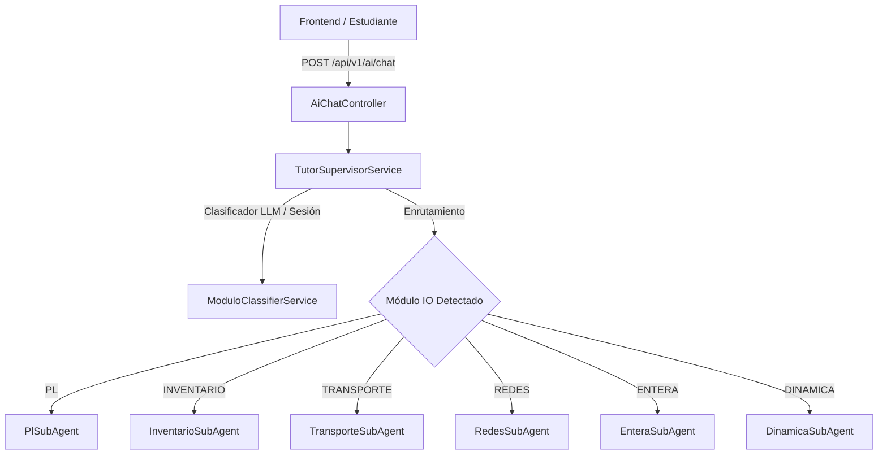
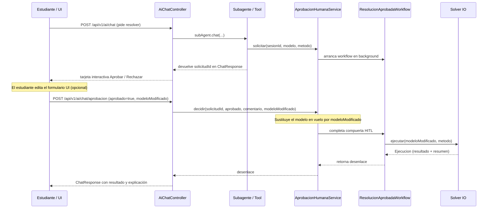

# Arquitectura de la Capa de Inteligencia Artificial — Asistente Pivot

La capa de IA de **Asistente Pivot** implementa una arquitectura **Multi-Agente Orquestada con Supervisor**, **Clasificador Semántico LLM** y validación pedagógica **Human-in-the-Loop (HITL)** con sincronización dinámica con el formulario de la UI.

---

## 1. Arquitectura Multi-Agente & Supervisor de Módulos

Para evitar el desbordamiento del contexto (*context overload*) y las tool calls malformadas que surgen al exponer decenas de herramientas simultáneas a un solo agente monolítico, el sistema divide las responsabilidades en 6 subagentes especializados y un orquestador central:



### Subagentes Especializados (`jpap.dev.io_api.infrastructure.ai.subagents`)
Cada subagente se construye en `AiConfig` mediante `AiServices.builder(...)` con:
- Un **prompt de sistema especializado** para su dominio pedagógico (`src/main/resources/prompts/subagents/`).
- Una **memoria de chat por ventana** (`MessageWindowChatMemory.withMaxMessages(14)`).
- Únicamente las **herramientas específicas de su módulo**:
  - **PlSubAgent**: `SugerirModeloTool`, `ValidarModeloTool`, `SimplexTool`, `GranMTool`, `DosFasesTool`, `GraficoTool`.
  - **InventarioSubAgent**: `InventarioTool`.
  - **TransporteSubAgent**: `TransporteTool`.
  - **RedesSubAgent**: `RedTool`.
  - **EnteraSubAgent**: `EnteraTool`, `SugerirModeloTool`, `ValidarModeloTool`.
  - **DinamicaSubAgent**: `DinamicaTool`.

### Clasificador Semántico Inteligente (`ModuloClassifierService`)
En lugar de depender de palabras clave rígidas, `TutorSupervisorService` invoca `ModuloClassifierService` (un agente ligero con LLM) que analiza el mensaje entrante y clasifica con precisión si pertenece a un nuevo módulo (`PL`, `INVENTARIO`, `TRANSPORTE`, `REDES`, `ENTERA`, `DINAMICA`) o si es una continuación conversacional (`CONTINUAR`). El módulo activo se conserva por sesión en memoria (`sesionModulo`).

---

## 2. Flujo Human-in-the-Loop (HITL) y Sincronización con Formulario UI

Ningún solver matemático es ejecutado de forma autónoma por la IA sin la confirmación expresa del estudiante.



### Sincronización 100% de Concordancia (`modeloModificado`)
1. Cuando la IA propone un modelo (`registrarModeloSugerido`), la UI lo dibuja en su formulario interactivo.
2. Si el usuario modifica valores en el formulario y hace clic en *"Aprobar"* en la tarjeta del chat, el frontend adjunta el estado actual del formulario en la propiedad `modeloModificado` del payload `DecisionAprobacionRequest`.
3. `AprobacionHumanaService.decidir(...)` deserializa automáticamente el JSON entrante al subtipo correspondiente (`ModeloLP`, `ModeloInventario`, `ModeloTransporte`, etc.) usando `MetodoResolucion.claseModeloPorMetodo(...)` y **reemplaza el modelo temporal de la solicitud**.
4. El solver se ejecuta sobre el modelo visible/editado por el estudiante.

---

## 3. Bus de Datos y Respuestas Estructuradas (`ChatContextStore`)

Las herramientas invocadas por los subagentes comunican artefactos visuales y resultados al frontend escribiendo en `ChatContextStore` (gestor `ThreadLocal`). Al finalizar el turno, `AiChatController` construye el objeto `ChatResponse` con:
- `respuesta`: texto explicativo en formato Markdown / Socrático.
- `modeloSugerido`: modelo estructurado para rellenar el formulario interactivo.
- `validacion`: feedback pedagógico sobre errores del estudiante.
- `solicitudAprobacion`: tarjeta HITL pendiente de decisión (`solicitudId`, `metodo`, `creadaEn`).
- `resultado` / `resultadoGrafico` / `resultadoTransporte` / `resultadoRedes` / `resultadoEntera` / `resultadoInventario` / `resultadoDinamica`: solución estructurada renderizable en tablas, gráficos o diagramas de red.

---

## 4. Actividad en vivo (`infrastructure/ai/actividad`)

`POST /api/v1/ai/chat` es **bloqueante**: no cuenta nada por el camino, así que la UI solo
sabría que "algo está pasando". Para que el estudiante vea *qué* está pasando —"Validando tu
modelo", "Resolviendo con MODI"— la fase viaja por un **canal aparte** que la UI sondea.

```
POST /ai/chat ──────────────────────────────────► (bloqueado ~2-8 s)
   │  publica fases mientras trabaja
   ▼
ActividadRegistry  (RAM, ConcurrentHashMap<sesionId, Actividad>)
   ▲
   │  GET /ai/chat/{sesionId}/actividad   ← la UI sondea cada 400 ms
```

### Piezas
- `FaseActividad` (enum) — las 7 fases y **la plantilla del texto que ve el estudiante**.
  El texto se compone aquí y viaja ya formado: el frontend solo lo pinta, sin diccionario
  paralelo en TypeScript.
- `Actividad` (record) — `fase`, `texto`, `secuencia` (contador monótono: la UI descarta
  sondeos que lleguen fuera de orden).
- `ActividadRegistry` — el mapa por sesión. `@Scheduled` purga entradas caducadas (>5 min)
  como red de seguridad si algún turno muere saltándose el `finally`.
- `EtiquetaMetodo` — traduce `MetodoResolucion` + modelo al **nombre real del algoritmo**.

### Dónde se publica cada fase

| Fase | Texto | Punto de publicación |
|---|---|---|
| `PENSANDO` | Analizando el enunciado | `AiChatController.chat`, al entrar |
| `ENRUTANDO` | Consultando el módulo de *X* | `TutorSupervisorService.chat`, tras elegir subagente |
| `FORMULANDO` | Formulando el modelo | `SugerirModeloTool` |
| `VALIDANDO` | Validando tu modelo | `ValidarModeloTool` |
| `PREPARANDO` | Preparando la resolución por *X* | `AprobacionHumanaService.solicitar` |
| `RESOLVIENDO` | Resolviendo con *X* | `AprobacionHumanaService.decidir` |
| `EXPLICANDO` | Preparando la explicación | `AiChatController.aprobacion` |

### Decisiones de diseño que NO hay que deshacer

- **No es `ThreadLocal`** como `ChatContextStore`: quien LEE la actividad es otra petición
  HTTP, en otro hilo, y el solver del HITL corre además en un hilo virtual de fondo.
  La clave tiene que ser la **sesión**, no el hilo.
- **`PREPARANDO` se publica en `AprobacionHumanaService.solicitar()`, no en
  `SolicitudAprobacionHelper`.** Las 17 `@Tool` de resolución pasan por el helper, pero
  `solicitar()` es el único punto que ya tiene sesión + modelo + método juntos: publicar ahí
  evita tocar las once clases de tools.
- **`RESOLVIENDO` se publica ANTES de abrir la compuerta HITL.** El solver corre en un hilo
  virtual mientras el hilo del request espera bloqueado; publicarlo después significaría que
  la UI nunca llega a ver la fase.
- **El nombre del algoritmo sale del modelo, no del enum.** `MetodoResolucion.TRANSPORTE` no
  enseña nada; el algoritmo concreto vive DENTRO del modelo (`ModeloTransporte.metodo()` →
  Vogel o MODI; Inventarios y PD tienen 5 submodelos cada uno). De eso se encarga `EtiquetaMetodo`.
- **El `sesionId` de una conversación nueva lo acuña el FRONTEND** (`crypto.randomUUID()`).
  El backend ya aceptaba cualquier UUID entrante (`esUuid` en `AiChatController`). Si lo
  acuñara el servidor, el primer turno no tendría `sesionId` que sondear y la actividad solo
  aparecería a partir del segundo mensaje.

### Coste
**Cero tokens.** No hay `@Tool` nueva, no se toca el system prompt y no hay llamadas extra al
LLM: la actividad se **observa** desde fuera, no se le pregunta al modelo (que además podría
mentir). El único coste es HTTP local: ~2,5 GET/s durante el turno, con respuestas de ~80 bytes.

Publicar es **best-effort**: ninguna llamada a `publicar` está en la ruta crítica de una
respuesta, y el sondeo del frontend nunca lanza.
