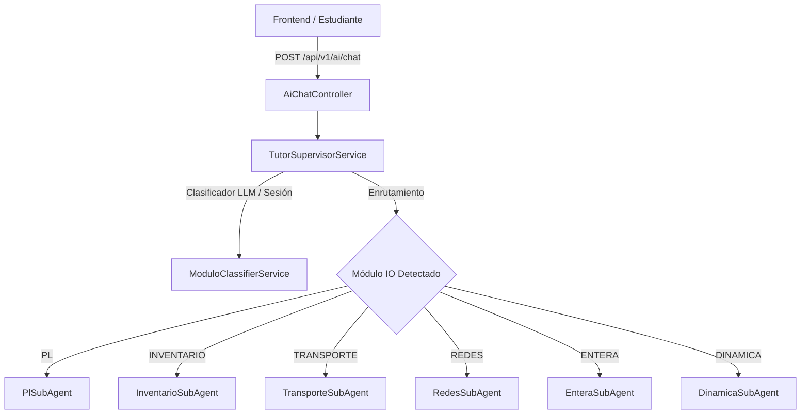
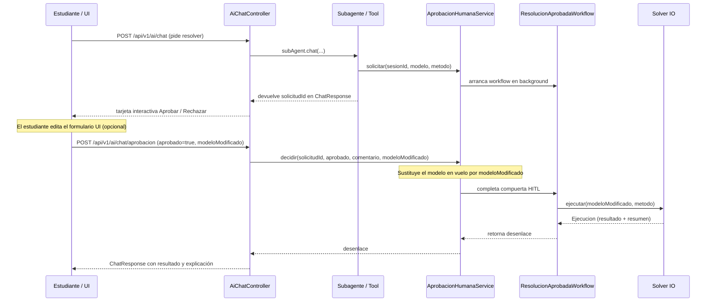

# Arquitectura de la Capa de Inteligencia Artificial — Asistente Pivot

La capa de IA de **Asistente Pivot** implementa una arquitectura **Multi-Agente Orquestada con Supervisor**, **Clasificador Semántico LLM** y validación pedagógica **Human-in-the-Loop (HITL)** con sincronización dinámica con el formulario de la UI.

---

## 1. Arquitectura Multi-Agente & Supervisor de Módulos

Para evitar el desbordamiento del contexto (*context overload*) y las tool calls malformadas que surgen al exponer decenas de herramientas simultáneas a un solo agente monolítico, el sistema divide las responsabilidades en 6 subagentes especializados y un orquestador central:

### Subagentes Especializados (`jpap.dev.io_api.infrastructure.ai.subagents`)
Cada subagente se construye en `AiConfig` mediante `AiServices.builder(...)` con:
- Un **prompt de sistema especializado** para su dominio pedagógico (`src/main/resources/prompts/subagents/`).
- Una **memoria de chat por ventana** (`MessageWindowChatMemory.withMaxMessages(14)`).
- Únicamente las **herramientas específicas de su módulo**:
  - **PlSubAgent**: `SugerirModeloTool`, `ValidarModeloTool`, `SimplexTool`, `GranMTool`, `DosFasesTool`, `GraficoTool`.
  - **InventarioSubAgent**: `InventarioTool`.
  - **TransporteSubAgent**: `TransporteTool`.
  - **RedesSubAgent**: `RedTool`.
  - **EnteraSubAgent**: `EnteraTool`, `SugerirModeloTool`, `ValidarModeloTool`.
  - **DinamicaSubAgent**: `DinamicaTool`.

### Clasificador Semántico Inteligente (`ModuloClassifierService`)
En lugar de depender de palabras clave rígidas, `TutorSupervisorService` invoca `ModuloClassifierService` (un agente ligero con LLM) que analiza el mensaje entrante y clasifica con precisión si pertenece a un nuevo módulo (`PL`, `INVENTARIO`, `TRANSPORTE`, `REDES`, `ENTERA`, `DINAMICA`) o si es una continuación conversacional (`CONTINUAR`). El módulo activo se conserva por sesión en memoria (`sesionModulo`).

---

## 2. Flujo Human-in-the-Loop (HITL) y Sincronización con Formulario UI

Ningún solver matemático es ejecutado de forma autónoma por la IA sin la confirmación expresa del estudiante.

### Sincronización 100% de Concordancia (`modeloModificado`)
1. Cuando la IA propone un modelo (`registrarModeloSugerido`), la UI lo dibuja en su formulario interactivo.
2. Si el usuario modifica valores en el formulario y hace clic en *"Aprobar"* en la tarjeta del chat, el frontend adjunta el estado actual del formulario en la propiedad `modeloModificado` del payload `DecisionAprobacionRequest`.
3. `AprobacionHumanaService.decidir(...)` deserializa automáticamente el JSON entrante al subtipo correspondiente (`ModeloLP`, `ModeloInventario`, `ModeloTransporte`, etc.) usando `MetodoResolucion.claseModeloPorMetodo(...)` y **reemplaza el modelo temporal de la solicitud**.
4. El solver se ejecuta sobre el modelo visible/editado por el estudiante.

---

## 3. Bus de Datos y Respuestas Estructuradas (`ChatContextStore`)

Las herramientas invocadas por los subagentes comunican artefactos visuales y resultados al frontend escribiendo en `ChatContextStore` (gestor `ThreadLocal`). Al finalizar el turno, `AiChatController` construye el objeto `ChatResponse` con:
- `respuesta`: texto explicativo en formato Markdown / Socrático.
- `modeloSugerido`: modelo estructurado para rellenar el formulario interactivo.
- `validacion`: feedback pedagógico sobre errores del estudiante.
- `solicitudAprobacion`: tarjeta HITL pendiente de decisión (`solicitudId`, `metodo`, `creadaEn`).
- `resultado` / `resultadoGrafico` / `resultadoTransporte` / `resultadoRedes` / `resultadoEntera` / `resultadoInventario` / `resultadoDinamica`: solución estructurada renderizable en tablas, gráficos o diagramas de red.
